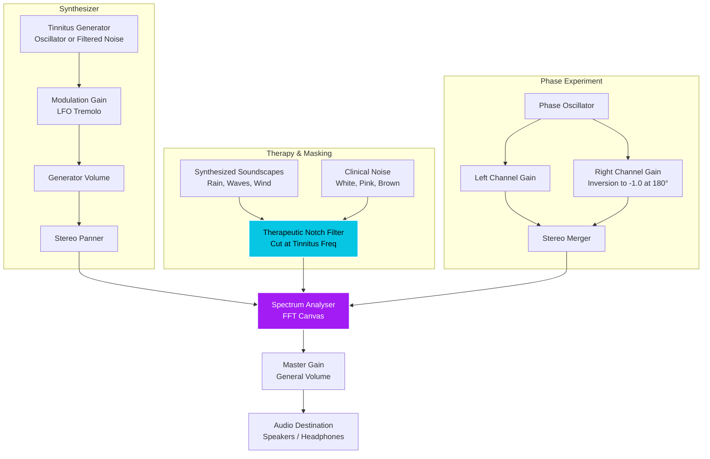

# Tinnitune — Tinnitus Synthesizer & Acoustic Therapy

> 🔗 **Live Demo:** [tinnitune.naudycastellanos.com](https://tinnitune.naudycastellanos.com)

Tinnitune is an interactive web-based tool designed for sound exploration, tinnitus frequency mapping, and custom masking sound therapy. Built natively using **HTML5, CSS3, Vanilla JavaScript, and the Web Audio API**, it delivers a seamless, zero-dependency audio experience with a premium, glassmorphic dark mode user interface.

---

## 🚀 Key Features

### 1. Tinnitus Tuner
*   **Selectable Waveform**: Pure Tone (sine wave), narrowband noise (resembling a sharp whistle), and broadband noise (pink or white noise).
*   **Precise Frequency Control**: Logarithmic coarse slider (20 Hz - 16 kHz) combined with fine tuning adjustments (±100 Hz).
*   **Tremolo Modulation**: Pulsating zumbido simulation via a Low Frequency Oscillator (LFO) with adjustable rate and depth.
*   **Stereo Balance & Volume**: Independent controls to shift the sound location or adjust the generator's volume.

### 2. Masking Mixer & Clinical Noise
*   **Therapeutic Notch Filter**: When enabled, it dynamically cuts out a narrow band around your matched tinnitus frequency from all background soundscapes. This promotes neural retraining by giving fatigued auditory receptors a rest.
*   **Synthesized Soundscapes**: Ocean waves (lowpass pink noise modulated by LFO), gentle rain (brown noise with high-pass droplets), and forest wind (slow LFO modulating a bandpass filter).
*   **Clinical Noise Generators**: Playback of dynamically generated White, Pink, and Brown noise.

### 3. Residual Inhibition (RI)
*   A circular visual timer (30s, 60s, 120s) that plays your matched tinnitus frequency at a similar volume level to test residual inhibition (the temporary reduction or elimination of tinnitus perception that occurs after auditory stimulation).

### 4. Wave Phase Experiment (Physical ANC)
*   Demonstrates constructive (0° in phase) and destructive (180° out of phase) wave interference. Learn how sound waves collide in physical space and cancel each other out when using external stereo speakers.

### 5. Preset Manager (Saved Settings)
*   Saves your current configurations (waveform type, frequencies, LFO rates, ambient volumes, and Notch Filter status) locally in the browser (`localStorage`) for quick one-click load or deletion.

### 6. Sleep Timer with Smooth Fade Out
*   Set a sleep timer (15, 30, 45, or 60 minutes) to play therapy soundscapes as you sleep.
*   **Gentle Fade Out**: During the last 60 seconds of the timer, the master volume declines exponentially to 0 to prevent waking the user up, resetting safely to your initial volume level afterward.

---

## 🛠️ Audio Architecture & Routing

Tinnitune leverages the power of the **Web Audio API** to process audio in real-time. The following diagram illustrates the routing path and connections of the audio nodes:



---

## 🖥️ Local Execution

Browsers restrict some Web Audio features and buffer loads when running directly from local files (`file://`). Running a lightweight local HTTP server is recommended:

### Method 1: Using Node.js (npx)
1. Launch the server from your project folder:
   ```bash
   npx http-server
   ```
2. Open the URL shown in your console (usually `http://localhost:8080`).

### Method 2: Using Python
1. Start the HTTP server from the command line:
   ```bash
   python -m http.server 8000
   ```
2. Open `http://localhost:8000` in your web browser.

---

## 🌐 Deployment

This is a fully static web application and can be hosted on any modern static hosting provider.

### Deploying to Cloudflare Pages
1. **Connect Repository**: Connect your GitHub repository to Cloudflare Pages via the Cloudflare Dashboard.
2. **Build Configuration**: Since this is a vanilla HTML/JS project, configure the build settings as follows:
   - **Framework preset**: `None`
   - **Build command**: Leave empty (no build step required)
   - **Build output directory**: `/` (root directory)
3. **Deploy**: Click **Save and Deploy**.
4. **Custom Domain**:
   - Go to your Page's project settings -> **Custom domains** -> **Set up a custom domain**.
   - Enter your desired subdomain (e.g., `tinnitune.naudycastellanos.com`).
   - If your domain `naudycastellanos.com` is managed by Cloudflare DNS, Cloudflare will automatically set up the CNAME record for you. If managed externally, add the provided CNAME record in your DNS registrar.

---

## 📄 Project Files
*   **`index.html`**: Semantic page structure, SVG icons, visualizer canvas, and panels.
*   **`style.css`**: Vanilla CSS styling featuring CSS variables, glassmorphic elements, and a responsive grid.
*   **`app.js`**: Main JS file handling Web Audio nodes, canvas render loop (`requestAnimationFrame`), and DOM event listeners.
*   **`CHANGELOG.md`**: Chronological log of versions and features added.
*   **`Docs/`**: Directory for extended documentation. Contains [future_development_ideas.md](file:///n:/Person/Project/024-Tinning/Test001/Docs/future_development_ideas.md) detailing clinical sound therapy expansion concepts (audiograms, symptom trackers, pulsed masking, etc.).

---

## ⚠️ Medical Disclaimer

This application is an educational sound exploration and therapeutic support tool. It is not a medical device, does not provide diagnostics, and does not replace the advice, diagnosis, or treatment of a health professional or audiologist. Use headphones at safe volumes to avoid further hearing damage.

---

## 📄 License

This project is licensed under the MIT License - see the [LICENSE](file:///n:/Person/Project/024-Tinning/Test001/LICENSE) file for details.
