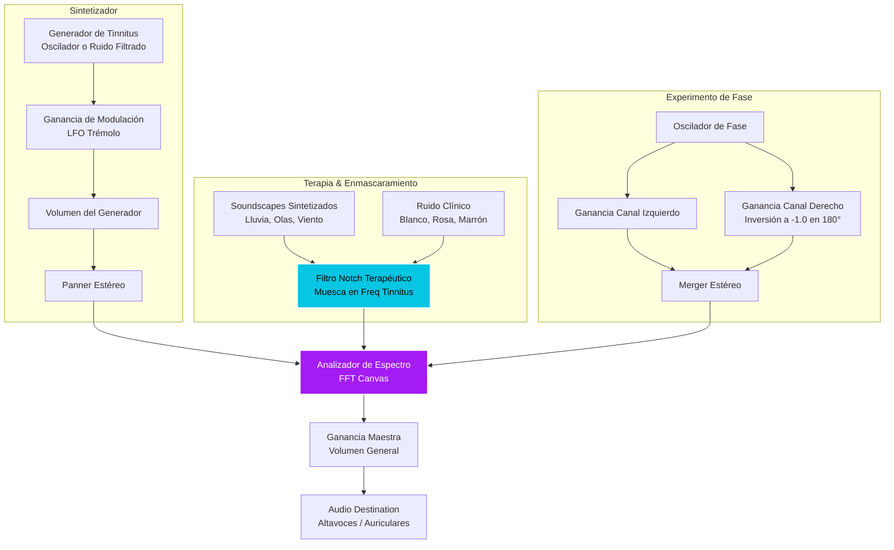

# Tinnitune — Sintetizador y Terapia de Tinnitus

Tinnitune es una herramienta interactiva basada en web diseñada para la experimentación acústica, sintonización de frecuencias de tinnitus y terapia de enmascaramiento personalizado. Desarrollada de manera nativa utilizando **HTML5, CSS3, JavaScript Vanilla y la Web Audio API**, ofrece una experiencia de sonido fluida sin dependencias externas y con una interfaz de diseño premium y moderno.

---

## 🚀 Características Principales

### 1. Sintonizador de Tinnitus (Tinnitus Tuner)
*   **Modo de Onda Seleccionable**: Tono puro (senoidal), ruido filtrado de banda estrecha (que simula silbidos agudos) y ruidos de banda ancha (rosa o blanco).
*   **Ajuste de Frecuencia Preciso**: Control logarítmico grueso de frecuencia (20 Hz - 16 kHz) acoplado con sintonía fina paso a paso (±100 Hz).
*   **Modulación de Trémolo**: Simulación de zumbido pulsante mediante un oscilador de baja frecuencia (LFO) con parámetros ajustables de velocidad y profundidad.
*   **Balance Estéreo y Volumen**: Permite configurar de qué lado (o en qué proporción) se percibe el zumbido de forma independiente.

### 2. Mezclador de Enmascaramiento y Ruido Clínico
*   **Filtro Notch (Muesca) Terapéutico**: Al activarse, elimina automáticamente una banda estrecha alrededor de la frecuencia identificada de tu tinnitus de todas las fuentes de enmascaramiento ambiental. Esto estimula la plasticidad neural al dar descanso a los receptores auditivos fatigados.
*   **Sonidos Ambientales Sintetizados**: Olas de océano (moduladas por LFO), lluvia suave (ruido marrón y altas frecuencias) y viento del bosque (filtros paso banda aleatorios).
*   **Generación de Ruidos Clínicos**: Acceso instantáneo a buffers locales de Ruido Blanco, Ruido Rosa y Ruido Marrón.

### 3. Inhibición Residual (RI)
*   Un temporizador visual (30s, 60s, 120s) con retroalimentación circular que reproduce el sonido idéntico de tu tinnitus a un volumen similar para probar la inhibición residual (silenciamiento temporal o disminución del zumbido que ocurre en el cerebro después del estímulo).

### 4. Experimento de Desfase de Onda (Fase Física)
*   Demuestra la interferencia constructiva (0° en fase) y destructiva (180° en contrafase). Permite experimentar cómo las ondas colisionan en el aire físico anulándose mutuamente si se usan altavoces estéreo externos.

### 5. Gestor de Ajustes Personalizados (Presets)
*   Almacena configuraciones específicas en la sesión del navegador (`localStorage`). Guarda el tipo de zumbido, volumen, balance, sonidos de fondo mezclados y el estado del filtro Notch para cargarlos o borrarlos de manera inmediata.

### 6. Temporizador de Apagado (Sleep Timer) con Desvanecimiento Gradual
*   Permite seleccionar una duración (15, 30, 45 o 60 minutos) para reproducir los sonidos de fondo.
*   **Desvanecimiento (Fade Out) Suave**: Durante los últimos 60 segundos del temporizador, el volumen desciende de manera progresiva para evitar cambios bruscos que despierten al usuario, restableciendo la ganancia de forma segura al finalizar.

---

## 🛠️ Arquitectura de Audio y Enrutamiento

Tinnitune aprovecha la potencia de la **Web Audio API** para procesar audio en tiempo de ejecución. El siguiente diagrama representa el flujo de señal y conexiones de los nodos de audio creados:



---

## 🖥️ Ejecución Local

Dado que la aplicación realiza operaciones de carga de buffers de audio y visualización de espectro, los navegadores restringen algunas características bajo el protocolo de archivos locales (`file://`). Se recomienda levantar un servidor local rápido:

### Método 1: Usando Node.js (npx)
1. Instala e inicia un servidor ligero:
   ```bash
   npx http-server
   ```
2. Abre la URL en el navegador (ej. `http://localhost:8080`).

### Método 2: Usando Python
1. Levanta el servidor desde la terminal en el directorio del proyecto:
   ```bash
   python -m http.server 8000
   ```
2. Accede a `http://localhost:8000`.

---

## 📄 Archivos del Proyecto
*   **`index.html`**: Estructura semántica, paneles interactivos, SVGs y el lienzo del Canvas.
*   **`style.css`**: Sistema de diseño basado en CSS Vanilla con variables personalizadas, efectos de cristal translúcido (glassmorphism) y diseño responsivo.
*   **`app.js`**: Lógica de inicialización del Web Audio API, bucle del visualizador con `requestAnimationFrame` y controladores del DOM.
*   **`CHANGELOG.md`**: Registro histórico de cambios y versiones del proyecto.
*   **`Docs/`**: Directorio de documentación extendida. Contiene [ideas_desarrollo_futuro.md](file:///n:/Person/Project/024-Tinning/Test001/Docs/ideas_desarrollo_futuro.md) con las propuestas de mejora auditiva (Audiogramas, trackers de síntomas, enmascaramiento intermitente, etc.).

---

## ⚠️ Descargo de Responsabilidad Médica

Esta aplicación es una herramienta didáctica e interactiva de apoyo acústico. No es un dispositivo médico, no proporciona diagnósticos clínicos y no reemplaza la opinión o tratamiento de un otorrinolaringólogo u audiólogo profesional. Evita escuchar sonidos a volúmenes excesivos para prevenir daños auditivos.
